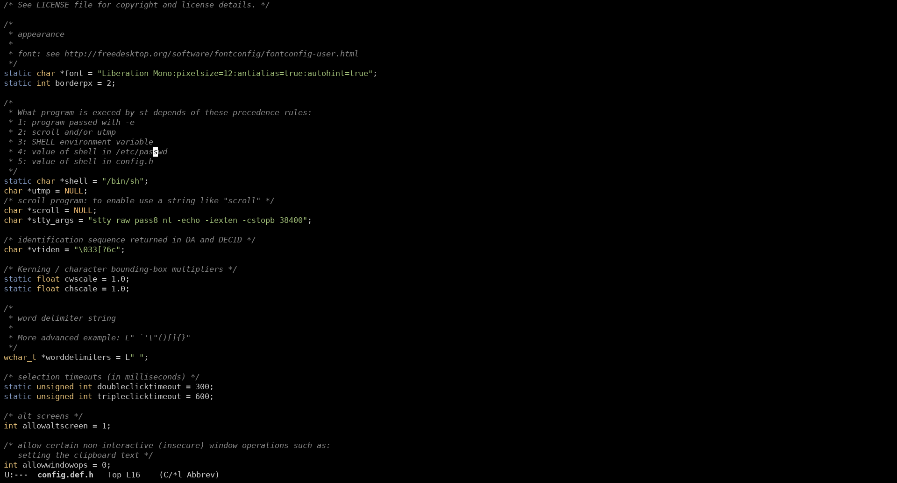

# spaceway

publish this theme cuz original repo was deleted or made private or something like that

# how to install
- download code file `wget https://raw.githubusercontent.com/e9000000000/emacs-spaceway-theme/main/spaceway-theme.el`
- open this file with emacs `emacs spaceway-theme.el`
- install package from file with `M-x package-install-file`
- switch theme to `spaceway` in `M-x customize-themes`
- press `Save Theme Settings` button
