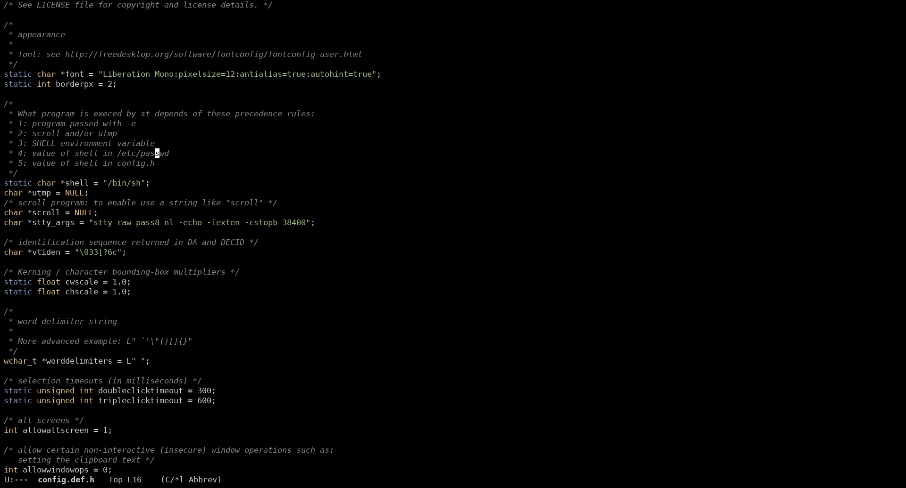

# spaceway

publish this theme cuz original repo was deleted or made private or something like that

# how to install
- download code file `wget https://raw.githubusercontent.com/e9000000000/emacs-spaceway-theme/main/spaceway-theme.el`
- put `spaceway-theme.el` into `.emacs.d'
- write line in your `.emacs`: `(load-theme 'spaceway t)`

